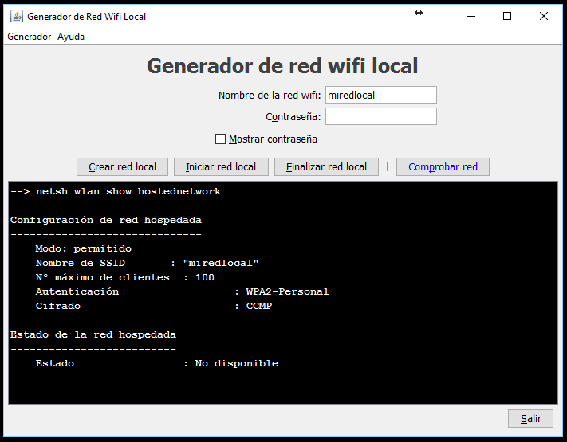

# Gestor Red Hospedada
Controla la red hospedada fácilmente desde una interfaz gráfica.

IGU para gestionar la red hospedada en windows (hosted (network), crearla, iniciarla y pararla.

* Crea la red hospedada (hostednetwork)
* Inicia la red hospedada
* Finaliza la red hospedada
* Comprueba el estado de la red hospedada

(Window Builder ha generado el código en espagueti, no "Lazy". Error al configurar el proyecto)
